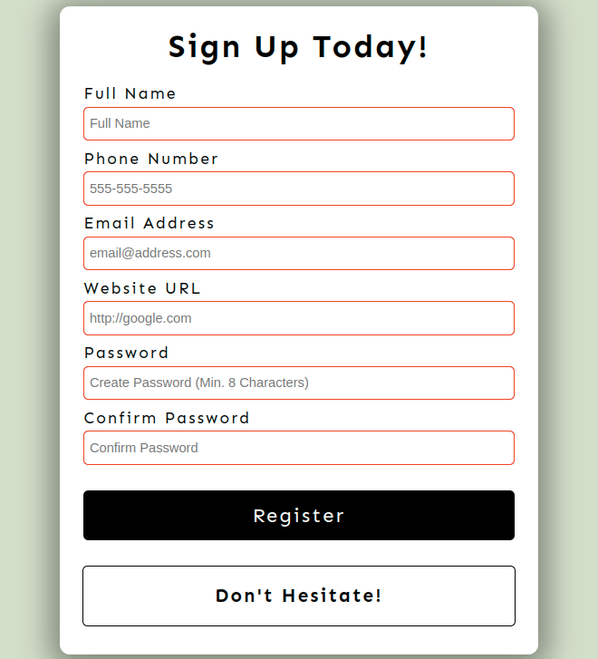

# basicJS_Form Validation: [LIVE DEMO](https://shcoobz.github.io/basicJS_form-validation/)

## Summary

Form Validation provides a sleek and user-friendly interface for users to sign up with their details. It features comprehensive input validation to ensure that all user-submitted data meets specific criteria before being processed.

The core functionality includes:

- Real-time input validation for full name, phone number, email address, website URL, and password fields.
- Visual feedback for valid and invalid inputs to enhance user experience.
- Secure password requirements enforcement, including the use of uppercase and lowercase letters, numbers, and minimum length.
- Confirmation of password match before submission.

## Features

### Input Validation

Each form input is validated in real-time, providing immediate feedback on the validity of the data entered. This includes pattern matching for phone numbers and email addresses, and length validation for names and passwords.

### Password Security

Passwords must meet specific criteria to be considered valid, including a minimum length of 8 characters, and the inclusion of both uppercase and lowercase letters, as well as numbers. This feature enhances the security of user accounts.

### User Feedback

The form provides visual cues for both valid and invalid inputs, with input borders turning green or red accordingly. A message is also displayed on successful registration or if there are errors that need to be addressed.

### Additional Features

This application is designed to be scalable, allowing for future enhancements such as integration with a backend database, email verification steps, and more sophisticated password security checks.

## Technologies

- HTML: Structure of the sign-up form and validation feedback.
- CSS: Styling of the form and responsive design.
- JavaScript: Client-side validation logic and user interaction handling.
- Google Fonts: Provides the font 'Sen' for a modern, clean look.

---

_Note: This document provides an overview of Form Validation. For detailed instructions and more information, please refer to the source code documentation._

_This project has been enhanced and converted into a React-based application, which can be viewed [here](https://github.com/Shcoobz/react_form-validation/). The React version integrates more advanced state management and component-based architecture for improved maintainability and scalability._
